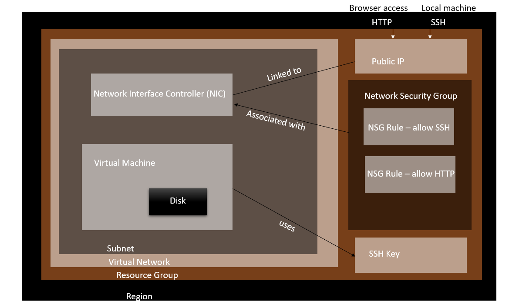

## Azure

#### Management Groups: 
- top-most level in the hierarchy.
- Useful for managing access, policies, and compliance across multiple Azure subscriptions.

#### Subscriptions:
- Act as a container for billing and resource management.
- Can be grouped under management groups.

#### Resource Groups:
- Containers that hold related resources for an Azure solution.
- Resources can only be a member of a single resource group.

#### Resources:
- Individual instances like virtual machines, databases, or storage accounts.
- Must be a member of a resource group.

## Deploying App



#### Step 1: Creating new SSH Key Pair
1. Open GitBash terminal
2. go into SSH folder
3. Create key pair 0- `ssh-keygen -t rsa -b 4096 -C "wafa.mohbubul@hotmail.com"`
4. Name it *tech254-wafa-az-key*
4. no pass phrase so enter twice
5. `ls` to check it has been generated
6. `cat tech254-wafa-az-key.pub` to copy the public key

#### Step 2: Login to Azure
1. Go to Azure *portal.azure.com*
2. Login with Sparta Global email and login details

#### Step 3: Link SSH Key Pair
3. Search *SSH Keys* in search bar and click on *SSH KEYS*
4. Click Create
5. Subscription is automatically filled in = Azure Training
6. Resource Group = Tech254
7. Region done automatically = (Europe (UK SOUTH))
8. Key Pair Name = *tech254-wafa-az-key*
9. SSH Public Key Resource > Upload existing public key
10. Upload key > Copy and Paste the **PUBLIC KEY**
11. click **Tabs**
12. Name = owner, Wafa
13. Click **Review + Create**
14. **Create**

#### Step 4: Create Virtual Network
1. Search Vnet
2. Click Create
2. Subscription is automatically filled in = Azure Training
6. Resource Group = Tech254
7. Virtual Network Name = **tech254-wafa-app-db-vnet
8. Region = (Europe) UK South 
9. Click **Next** 
**NOTE: Security Page left alone. Nothing ticked**
10. Click **Next** to *IP Addresses*
11. Click the pen/pencil edit button and a popup should appear
12. Edit Name to *public-subnet*
13. Starting address = `10.0.2.0/24`
14. Press Add
15. Add Subnet 
16. Edit Name to *private-subnet*
13. Starting address = `10.0.3.0/24`
14. press Add
16. Next to Tags
17. Name = Owner
18. Value = Wafa

#### Step 5: Create Virtual Machines
1. Search VM
2. Click Virtual Machine
3. Click Create
4. Virtual machine name = `tech254-wafa-first-app-vm`
5. Image = Search for Image = `Ubuntu Pro 18.04 LTS - x64 Gen2`
6. Security Type = Standard
7. Size = Standard_B1s -1 vpcus
8. Username = adminuser
9. SSH Public key source > Use existing key stored in Azure
10. Stored keys = `tech254-wafa-az-key`
11. Click HTTP and SSH for Security Inbound Rules
11. Click Next to DISK
12. sELECT Standard SSD
13. Next To Networking
14. Select your Virtual Network
15. Subnet > public-subnet
16. Check the *Delete Public IP and NIC when VM is deleted*
14. Skip Management and Monitoring 
15. Go to Advanced
16. Copy and paste script to User Data:
```commandline
#!/bin/bash

# update & upgrade
sudo apt update -y
sudo DEBIAN_FRONTEND=noninteractive apt-get upgrade -y -o Dpkg::Options::="--force-confnew"

# install nginx
sudo apt install nginx -y

# setup nginx reverse proxy
sudo apt install sed
# $ and / characters must be escaped by putting a backslash before them
sudo sed -i "s/try_files \$uri \$uri\/ =404;/proxy_pass http:\/\/localhost:3000\/;/" /etc/nginx/sites-available/default

# restart nginx
sudo systemctl restart nginx

#enable nginx

sudo systemctl enable nginx

# install nodejs 12.x
curl -sL https://deb.nodesource.com/setup_12.x | sudo -E bash -
sudo apt-get install nodejs -y

# install pm2 (only necessary later)
sudo npm install pm2 -g

# clone repo with app folder into folder called 'repo' - only needed if don't have the app folder already
sudo apt install git -y

git clone https://github.com/WafaMohbubul/sparta-test-app.git repo

# install the app (must be after db vm is finished provisioning)
cd repo
cd app
npm install

# start the app (could also use 'npm start')
pm2 start app.js
```
17. Go to Tags > "Owner" and "Wafa"

#### Connecting via SSH
1. Click your app VM
2. On left-hand navigation, click *Connect*
3. Click **Native SSH** and pop up will appear yesterday
4. Type `~/.ssh/tech254-wafa-az-key` and copy and paste grey area into ssh file on GitBash terminal
[Identity.url](..%2F..%2F..%2FAppData%2FLocal%2FTemp%2FIdentity.url)


## Deploying DB

#### Create DB VM
1. Search VM
2. Click Virtual Machine
3. Click Create
4. Virtual machine name = `tech254-wafa-first-app-vm`
5. Image = Search for Image = `Ubuntu Pro 18.04 LTS - x64 Gen2`
6. Security Type = Standard
7. Size = Standard_B1s -1 vpcus
8. Username = adminuser2
9. SSH Public key source > Use existing key stored in Azure
10. Stored keys = `tech254-wafa-az-key`
11. Click HTTP and SSH for Security Inbound Rules
11. Click Next to DISK
12. sELECT Standard SSD
13. Next To Networking
14. Select your Virtual Network
15. Subnet > public-subnet
16. Check the *Delete Public IP and NIC when VM is deleted*
14. Skip Management and Monitoring 
15. Go to Advanced
16. Copy and paste script to User Data:
```commandline
#!/bin/bash

# Update and upgrade packages
sudo apt update
sudo DEBIAN_FRONTEND=noninteractive apt-get upgrade -y -o Dpkg::Options::="--force-confnew"

# Acquire the MongoDB 3.2 key
wget -qO - https://www.mongodb.org/static/pgp/server-3.2.asc | sudo apt-key add -
echo "Acquired MongoDB 3.2 key successfully."

# Add MongoDB repository to sources.list
echo "deb http://repo.mongodb.org/apt/ubuntu xenial/mongodb-org/3.2 multiverse" | sudo tee /etc/apt/sources.list.d/mongodb-org-3.2.list

# Update packages to fetch MongoDB 3.2
sudo apt update

# Install MongoDB 3.2 packages
sudo apt-get install -y mongodb-org=3.2.20 mongodb-org-server=3.2.20 mongodb-org-shell=3.2.20 mongodb-org-mongos=3.2.20 mongodb-org-tools=3.2.20
echo "MongoDB 3.2 installed successfully."

# Modify MongoDB configuration to allow all connections
sudo sed -i 's/bindIp: 127.0.0.1/bindIp: 0.0.0.0/' /etc/mongod.conf
echo "Modified MongoDB configuration to allow all connections."

# Start MongoDB and enable auto-start
sudo systemctl start mongod
sudo systemctl enable mongod

# Check MongoDB service status
sudo systemctl status mongod
```

#### Create NEW APP VM
1. Create new app VM
2. Copy and Paste in User Data:
```commandline
#!/bin/bash

# update & upgrade
sudo apt update -y
sudo DEBIAN_FRONTEND=noninteractive apt-get upgrade -y -o Dpkg::Options::="--force-confnew"


# install nginx
sudo apt install nginx -y

# setup nginx reverse proxy
sudo apt install sed
# $ and / characters must be escaped by putting a backslash before them
sudo sed -i "s/try_files \$uri \$uri\/ =404;/proxy_pass http:\/\/localhost:3000\/;/" /etc/nginx/sites-available/default

# restart nginx
sudo systemctl restart nginx

#enable nginx

sudo systemctl enable nginx

# install nodejs 12.x
curl -sL https://deb.nodesource.com/setup_12.x | sudo -E bash -
sudo apt-get install nodejs -y

export DB_HOST=mongodb://10.0.3.4:27017/posts

# install pm2 (only necessary later)
sudo npm install pm2 -g

# clone repo with app folder into folder called 'repo' - only needed if don't have the app folder already
sudo apt install git -y

git clone https://github.com/wafaMohbubul/sparta_test_app.git

# install the app (must be after db vm is finished provisioning)
cd sparta_test_app
cd app
npm install
node seeds/seed.js

pm2 kill

# start the app (could also use 'npm start')
pm2 start app.js
```


