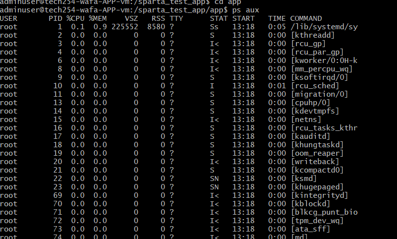
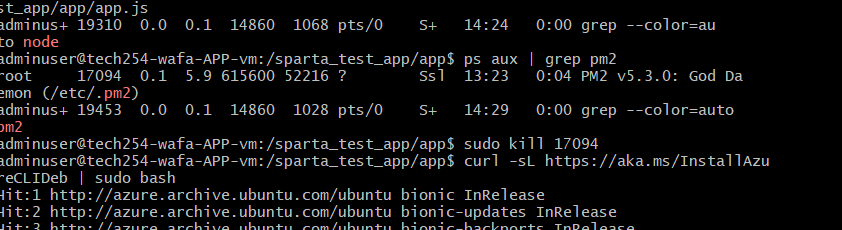
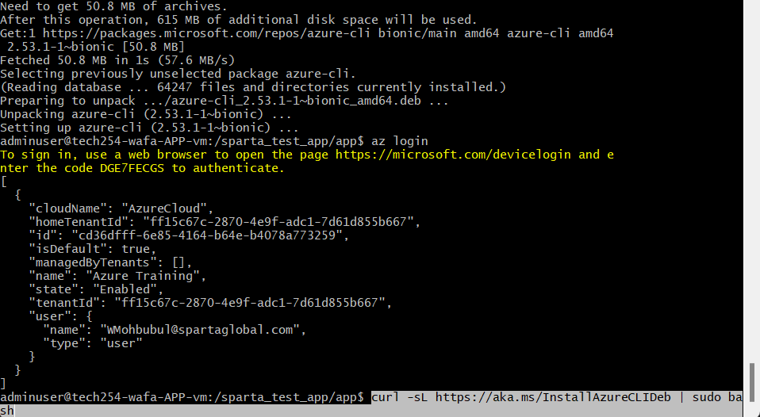

## Kill app (Azure) from terminal

1. Connect to App Vm via SSH to GitBash terminal
2. Run `cd /` to be inside root
3. `cd sparta_test_app`
4. `cd app`
5. `ps aux` - to view list of processes including those in background

6. `ps aux | grep pm2`

NOTE: pm2 should be displayed in red

6. Run command `sudo kill <ID OF ROOT PM2>`

## Azure CLI

1. Copy and Paste Command "curl -sL https://aka.ms/InstallAzureCLIDeb | sudo bash" in GitBash terminal - downloads CLI 

Should receive a message in yellow with link and key. 

2. Copy and paste link into a new browser
3. When prompted, paste the key and login 
4. Return back to GitBash and run `az login`