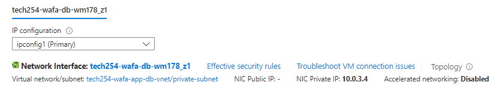

## Removing Public IP Address from DB VM

1. Go onto **Networking** under **Settings** 
2. Click on the link next to the green icon

3. Click on **IP Configuration** 
4. Click on `ipconfig1`, a popup should appear.
5. Unselect the **Associate public IP address**
